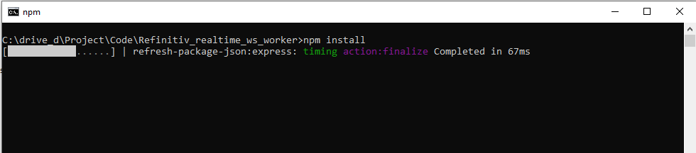
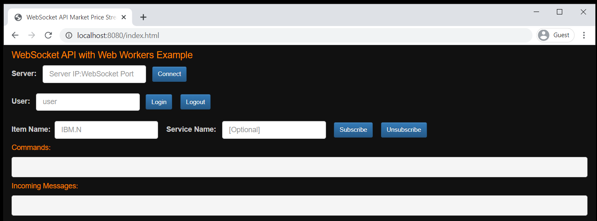

# Refinitiv Real-time WebSocket API with Web Workers Example 

- Last update: Jan 2021
- Environment: Any 
- Compiler: JavaScript
- Prerequisite: Refinitiv Real-Time Advanced Data Hub and Refinitiv Real-Time Advanced Distribution servers version 3.2.1 and above

## Overview

[Websocket API for Pricing Streaming and Real-Time Service](https://developers.refinitiv.com/en/api-catalog/elektron/refinitiv-websocket-api) aka Websocket API application enables easy integration into a multitude of client technology environments such as scripting and web.  This API runs directly on your Refinitiv Real-Time infrastructure and presents data in an open (JSON) readable format. The API supports all Refinitiv Real-Time data models and can be integrated into multiple client technology standards e.g. Python, R, .Net, etc.

The web browser's JavaScript runtime is a single-threaded environment by default. However, the HTML standard lets developers implement multi-threads JavaScript application in the web browser by introducing the [Web Workers](https://html.spec.whatwg.org/multipage/workers.html) feature that lets web browsers run JavaScripts in the main thread and a background thread (workers thread).

This example shows how to implement the Refinitiv Real-time WebSocket API with JavaScript web application with Web Workers. It allows the Web Workers thread to handle the connection logic with eal-Time Advanced Distribution server while the main thread handles the UI interaction events and displaying data.

There are two types of Web Workers, [Dedicated Workers](https://html.spec.whatwg.org/multipage/workers.html#dedicated-workers-and-the-worker-interface) and [Shared Workers](https://html.spec.whatwg.org/multipage/workers.html#sharedworker). This example covers only how to implement the Refinitiv Real-time WebSocket API with JavaScript web browser application with Dedicated Workers.

*Note: The initial release of this API is for deployed Refinitiv Real-Time Advanced Distribution Server customers only (i.e. to use it you will need an installed version of Refinitiv Real-Time Advanced Distribution Server 3.2.1 and above). 

## Supported Web Browsers
The example supports Chrome/Microsoft Edge (Chrome-based version), Firefox, and IE11 (based on the WebSocket and Web Workers browser supported platform).

## Prerequisite
This example requires the following dependencies software.
1. [Node.js](https://nodejs.org/en/) runtime - version 8.9.3 or higher.
2. [npm](https://www.npmjs.com/) package manager (included with Node.js runtime)
3. [Express.js](https://expressjs.com/) framework (will be installed via ```npm install``` command)

This example also uses the following 3rd party libraries for UI presentation.
1. [jQuery 3.2.1](https://jquery.com/) JavaScript library
2. [Bootstrap 3.3.7](https://getbootstrap.com/docs/3.3/) CSS library

jQuery,Bootstrap and Express.js are distributed under the [MIT license](https://opensource.org/licenses/MIT). Please see more detail in the LICENSE.md file. 

## Example files and folders
The web application contains the following example files and folder:
1. index.html: The application HTML page
2. app/market_price_app.js: The application main file
3. app/ws_workers.js: The application Web Workers file
4. css/cover.css: The application CSS file
5. libs/jquery-3.2.1.min.js: jQuery library file
6. bootstrap/css, bootstarp/fonts and bootstrap/js folders: The folders for Bootstrap CSS and libraries files
7. server.js: A simple web server application
8. package.json: The Project npm dependencies file. 

## How to run this example
1. Unzip or download the example project folder into a directory of your choice 
2. Run ```$> npm install``` in the command prompt to install all the dependencies required to run the sample in a subdirectory called *node_modules/*.



3. If the machine is behind a proxy server, you need to configure Node.js uses proxy instead of a direct HTTP connection via the following command in a command prompt: ```set https_proxy=http://<proxy.server>:<port>```
4. Run ```$> node server.js``` in the command prompt to start the webserver at HTTP port 8080


5. Open the web browser (IE11, Chrome/Microsoft Edge (Chrome-based version), and Firefox), then navigate to index.html of the web server at ```http://localhost:8080/index.html```




## References

For further details, please check out the following resources:
* [Refinitiv Real-Time & Distribution Family page](https://developers.refinitiv.com/en/use-cases-catalog/refinitiv-real-time) on the [Refinitiv Developer Community](https://developers.refinitiv.com/) web site.
* [WebSocket API page](https://developers.refinitiv.com/en/api-catalog/elektron/refinitiv-websocket-api).
* [Developer Webinar Recording: Introduction to Electron Websocket API](https://www.youtube.com/watch?v=CDKWMsIQfaw)
* [Mozilla Developer Network: Web Workers API page](https://developer.mozilla.org/en-US/docs/Web/API/Web_Workers_API).
* [Google HTML5 Rocks: The Basics of Web Workers page](https://www.html5rocks.com/en/tutorials/workers/basics/)
* [Mozilla Developer Network: WebSocket API page](https://developer.mozilla.org/en-US/docs/Web/API/WebSockets_API)

For any questions related to this article or the WebSocket API page, please use the Developer Community [Q&A Forum](https://community.developers.refinitiv.com/spaces/152/websocket-api.html).

