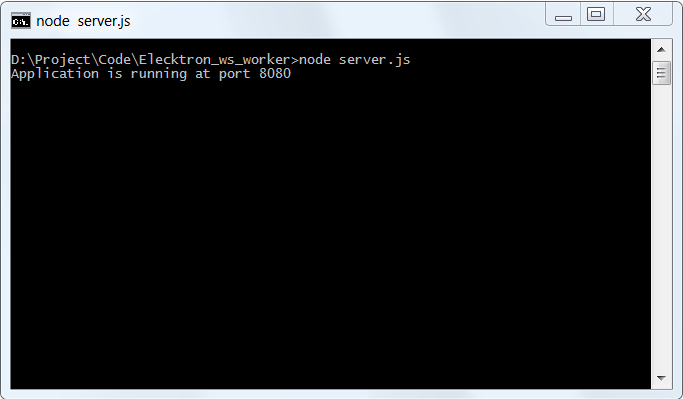

# Elektron WebSocket API with Web Workers Example 
## Overview

[Elektron WebSocket API](https://developers.thomsonreuters.com/websocket-api) enables easy integration into a multitude of client technology environments such as scripting and web.  This API runs directly on your TREP infrastructure or the Thomson Reuters platform and presents data in an open (JSON) readable format. The API supports all Thomson Reuters Elektron data models and can be integrated into multiple client technology standards e.g. Python, R, .Net etc.

The web browsers JavaScript runtime is a single-threaded environment by default. However, the HTML standard lets developers implement multi threads JavaScript application in web browser by introducing the [Web Workers](https://html.spec.whatwg.org/multipage/workers.html) feature that lets web browsers run JavaScripts in a main thread and a background thread (workers thread).

This example shows how to implement the Elektron WebSocket API with JavaScript web application with Web Workers. It lets the Web Workers thread handles a connection logic with ADS WebSocket while the main thread handles the UI interaction events and displaying data.

There are two types of the Web Workers, [Dedicated Workers](https://html.spec.whatwg.org/multipage/workers.html#dedicated-workers-and-the-worker-interface) and [Shared Workers](https://html.spec.whatwg.org/multipage/workers.html#sharedworker). This example covers only how to implement the Elektron WebSocket API with JavaScript web browser application with Dedicated Workers.

*Note: The initial release of this API is for deployed TREP customers only (i.e. to use it you will need an installed version of TREP 3.2). 

## Supported Web Browsers
The example supports Chrome, Firefox and IE11 (based on the WebSocket and Web Workers browser supported platform).

## Prerequisite
This example requires the following dependencies softwares.
1. [Node.js](https://nodejs.org/en/) - version 6.10 or higher.
2. [npm](https://www.npmjs.com/) package manager (included in Node.js)
3. [Express.js](https://expressjs.com/) framework

This example also uses the following 3rd party libraries for UI presentation.
1. [jQuery 3.2.1](https://jquery.com/) 
2. [Bootstrap 3.3.7](https://getbootstrap.com/docs/3.3/)

jQuery,Bootstrap and Express.js are distributed under the [MIT license](https://opensource.org/licenses/MIT). Please see more detail in the LICENSE.md file. 

## Example files and folders
The web application contains the following example files and folder:
1. index.html: The application HTML page
2. app/market_price_app.js: The application main file
3. app/ws_workers.js: The application Web Workers file
4. css/cover.css: The application CSS file
5. libs/jquery-3.2.1.min.js: jQuery library file
6. bootstrap/css, bootstarp/fonts and bootstrap/js folders: The folders for Bootstrap CSS and libraries files
7. node_modules folder: Folder for Node.js and Express.js modules for web server running
8. server.js: A web server application
9. package.json: The Project npm dependencies file. 

## How to run this example
1. Unzip or download the example project folder into a directory of your choice 
2. Run ```$> npm install``` in the command prompt to install all the dependencies required to run the sample in a subdirectory called *node_modules/*.


3. If the machine is behind a proxy server, you need to configure Node.js uses proxy instead of a direct HTTP connection via the following command in command prompt: ```set https_proxy=http://<proxy.server>:<port>```
4. Run ```$> node server.js``` in the command prompt to start the web server at HTTP port 3000



5. Open web browser (IE11, Chorme and Firefox), then navigate to index.html of the web server at ```http://localhost:300/index.html```


## References
For further details, please check out the following resources:
* [Thomson Reuters Elektron WebSocket API page](https://developers.thomsonreuters.com/websocket-api) on the [Thomson Reuters Developer Community](https://developers.thomsonreuters.com/) web site.
* [Mozilla Developer Network: Web Workers API page](https://developer.mozilla.org/en-US/docs/Web/API/Web_Workers_API).
* [Google HTML5 Rocks: The Basics of Web Workers page](https://www.html5rocks.com/en/tutorials/workers/basics/)

For any question related to this article or Elektron WebSocket API page, please use the Developer Community [Q&A Forum](https://community.developers.thomsonreuters.com/).
